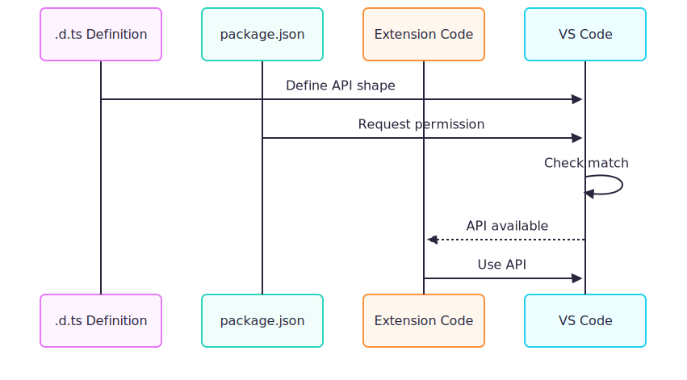

# VS Code Proposed APIs

A comprehensive guide to understanding what Proposed APIs are, why they exist, and how to use them in your VS Code extensions.

## What Are Proposed APIs?

Proposed APIs are **experimental VS Code APIs** that are not yet stable. They allow extensions to access features that are still being designed and tested by the VS Code team.

When the VS Code team wants to add new functionality to the extension API, they don't immediately make it available to everyone. Instead, they first release it as a "proposed" API. This gives extension developers a chance to try out the new features and provide feedback before the API becomes permanent.

Think of proposed APIs as a **beta testing program** for new VS Code features. The VS Code team uses feedback from developers who try these APIs to refine the design, fix issues, and ensure the API meets real-world needs before "graduating" it to a stable API.

**Why does this matter?** Because once an API becomes stable, VS Code commits to maintaining backward compatibility. Any changes to stable APIs must be carefully versioned to avoid breaking existing extensions. Proposed APIs don't have this constraint—they can change dramatically or even be removed entirely between VS Code versions.


## Stable vs Proposed APIs

Understanding the difference between stable and proposed APIs is crucial for extension development:

| Aspect | Stable API | Proposed API |
|--------|-----------|--------------|
| Availability | All extensions | Opt-in only |
| Breaking changes | Rare, versioned | Can change anytime |
| Documentation | Official docs | `.d.ts` files only |
| Marketplace | Allowed | **Blocked** |

### Stable APIs

Stable APIs are the "official" VS Code extension APIs documented at [code.visualstudio.com/api](https://code.visualstudio.com/api). These APIs have been tested, refined, and are guaranteed to work consistently across VS Code versions. When you use stable APIs, you can confidently publish your extension to the VS Code Marketplace, knowing it will work for all users.

Examples of stable APIs include `vscode.window.showInformationMessage()`, `vscode.workspace.openTextDocument()`, and `vscode.commands.registerCommand()`. These have been part of VS Code for years and are unlikely to change.

### Proposed APIs

Proposed APIs are experimental features that exist in VS Code's source code but are not exposed to regular extensions. They require explicit opt-in and can only be used in specific scenarios:

1. **Development mode** - Running VS Code from source with `./scripts/code.sh`
2. **Extension Development Host** - Testing extensions via F5 in VS Code
3. **Insider builds** - With special configuration flags

The most important limitation: **extensions using proposed APIs cannot be published to the VS Code Marketplace**. This is intentional—it prevents users from installing extensions that might break when VS Code updates.

## How Proposed APIs Work

The proposed API system involves three components that must all align for the API to work:

### Step 1: VS Code Defines the API

Each proposed API has a TypeScript definition file located in VS Code's source code. These files define the shape of the API—what functions exist, what parameters they take, and what they return.

```
src/vscode-dts/vscode.proposed.terminalSelection.d.ts
src/vscode-dts/vscode.proposed.chatProvider.d.ts
src/vscode-dts/vscode.proposed.embeddings.d.ts
```

The naming convention is always `vscode.proposed.<apiName>.d.ts`. The `<apiName>` portion is what you'll use to request access to that API.

> **Note:** Extensions must copy these `.d.ts` files into their project for TypeScript to recognize the APIs. Without these files, TypeScript will show errors when you try to use proposed API features. In Puku Editor, they're copied to `src/chat/src/extension/`.

### Step 2: Extension Requests Permission

Your extension must explicitly declare which proposed APIs it wants to use. This is done in your `package.json` file using the `enabledApiProposals` array:

```json
{
  "enabledApiProposals": [
    "terminalSelection",
    "chatProvider",
    "embeddings"
  ]
}
```

Each string in this array corresponds to a proposed API name (the `<apiName>` from the `.d.ts` filename). VS Code checks this list when loading your extension and only enables the APIs you've requested.

**Why require explicit opt-in?** This design ensures that:
- Extension authors consciously choose to use experimental features
- VS Code can track which extensions use which proposed APIs
- Extensions don't accidentally depend on unstable features

### Step 3: Extension Uses the API

Once you've copied the `.d.ts` file and declared the API in `package.json`, you can use the proposed API in your extension code just like any other VS Code API:

```typescript
// Now you can use the proposed API
const selectedText = terminal.selection;
```

The key difference is that this code will only work in development/testing environments, not in production VS Code.



## Why Use Proposed APIs?

Given the limitations—no Marketplace publishing, potential breaking changes, extra setup—why would anyone use proposed APIs?

### 1. Access to Cutting-Edge Features

Many of VS Code's most powerful features started as proposed APIs. The entire GitHub Copilot Chat system, for example, relies heavily on proposed APIs for chat participants, language model access, and tool integration. If you want to build AI-powered extensions, you often have no choice but to use proposed APIs.

### 2. Influence API Design

By using proposed APIs and providing feedback, you can influence how the final stable API will work. The VS Code team actively considers feedback from extension developers when refining proposed APIs.

### 3. Building Internal Tools

If you're building extensions for internal use (not publishing to the Marketplace), proposed APIs give you access to features that aren't otherwise available. Many companies build custom VS Code distributions with proposed APIs enabled for their development teams.

### 4. Forked VS Code Distributions

Projects like Puku Editor, Cursor, and other VS Code forks can enable proposed APIs in their distributions. Since they control the entire VS Code build, they can use proposed APIs in production.


## Quick Example: Terminal Selection

Let's see the difference proposed APIs make with a concrete example. The `terminalSelection` API lets you read what text the user has selected in the terminal.

**Without proposed API:**
```typescript
// ❌ Cannot access terminal selection
const terminal = vscode.window.activeTerminal;
// terminal.selection does not exist - TypeScript error!
// There's simply no way to read terminal selection with stable APIs
```

**With proposed API:**
```typescript
// ✓ Can access terminal selection
const terminal = vscode.window.activeTerminal;
const text = terminal.selection; // Works! Returns the selected text
```

This simple example shows why proposed APIs matter: some functionality simply doesn't exist in stable APIs yet.

## Hands-On Example: Build Your First Proposed API Extension

Let's build a complete extension that uses the `terminalSelection` proposed API. This walkthrough will show you the entire process from project setup to testing.

### Project Structure

Create a new folder for your extension with the following structure:

```
my-test-extension/
├── extension.js                              ← Your extension code
├── package.json                              ← Extension manifest
└── vscode.proposed.terminalSelection.d.ts    ← Copied from VS Code source
```

### Step 1: Create `package.json`

The `package.json` file is your extension's manifest. It tells VS Code about your extension and, importantly, declares which proposed APIs you need:

```json
{
    "name": "my-test-extension",
    "displayName": "My Test Extension",
    "version": "0.0.1",
    "engines": {
        "vscode": "^1.100.0"
    },
    "activationEvents": [
        "onStartupFinished"
    ],
    "main": "./extension.js",
    "enabledApiProposals": [
        "terminalSelection"
    ],
    "contributes": {
        "commands": [
            {
                "command": "myext.getSelection",
                "title": "My Extension: Get Terminal Selection"
            }
        ]
    }
}
```

> **Key line:** `"enabledApiProposals": ["terminalSelection"]` - This requests permission to use the proposed API. Without this line, VS Code won't expose the `terminal.selection` property.

### Step 2: Create `extension.js`

This is your extension's main code. It registers a command that reads the terminal selection and shows it in a notification:

```javascript
const vscode = require('vscode');

function activate(context) {
    console.log('Extension activated!');

    // Register a command that users can run from the Command Palette
    let command = vscode.commands.registerCommand('myext.getSelection', () => {

        // Get the currently active terminal
        const terminal = vscode.window.activeTerminal;

        if (terminal) {
            // Use the PROPOSED API to read the selection
            const selection = terminal.selection;  // ← Proposed API!

            if (selection) {
                // Show the selected text to the user
                vscode.window.showInformationMessage(`Selected by User in terminal is: ${selection}`);
            } else {
                vscode.window.showInformationMessage('No text selected in terminal');
            }
        } else {
            vscode.window.showInformationMessage('No active terminal');
        }
    });

    // Register the command so it gets cleaned up when the extension deactivates
    context.subscriptions.push(command);
}

function deactivate() { }

module.exports = { activate, deactivate };
```

### Step 3: Copy the Proposed API Definition

For TypeScript to understand the proposed API (and for your editor to provide autocomplete), you need the type definition file. Copy it from VS Code's source:

```bash
cp src/vscode-dts/vscode.proposed.terminalSelection.d.ts /path/to/my-test-extension/
```

If you're using JavaScript (not TypeScript), this step is technically optional, but it's still recommended for better editor support.

### Step 4: Run VS Code with Your Extension

You cannot test proposed APIs in regular VS Code. You must run VS Code from source or use the Extension Development Host. The easiest way is to run VS Code from source:

```bash
./scripts/code.sh --extensionDevelopmentPath=/path/to/my-test-extension
```

This launches a special instance of VS Code with your extension loaded and proposed APIs enabled.

### Step 5: Test It

1. Open a terminal in VS Code (`Ctrl+`` ` or View → Terminal)
2. Type some text in the terminal
3. Select some of that text with your mouse
4. Open Command Palette (`Ctrl+Shift+P` or `Cmd+Shift+P` on Mac)
5. Type and run "My Extension: Get Terminal Selection"
6. See the selected text displayed in a notification!

> **Important:** Proposed APIs only work when running VS Code from source or in Extension Development Host mode. They won't work in production VS Code builds downloaded from code.visualstudio.com.

## Real-World Example: Puku Editor's package.json

Here's how Puku Editor declares its 48 proposed APIs in `src/chat/package.json`:

```json
{
    "name": "puku-editor",
    "displayName": "Puku Editor",
    "version": "0.43.34",
    "engines": {
        "vscode": "^1.107.0"
    },
    "main": "./dist/extension",
    "enabledApiProposals": [
        "extensionsAny",
        "newSymbolNamesProvider",
        "interactive",
        "codeActionAI",
        "activeComment",
        "commentReveal",
        "contribCommentThreadAdditionalMenu",
        "contribCommentsViewThreadMenus",
        "documentFiltersExclusive",
        "embeddings",
        "findTextInFiles",
        "findTextInFiles2",
        "findFiles2",
        "findFiles2@2",
        "textSearchProvider",
        "terminalDataWriteEvent",
        "terminalExecuteCommandEvent",
        "terminalSelection",
        "terminalQuickFixProvider",
        "mappedEditsProvider",
        "aiRelatedInformation",
        "aiSettingsSearch",
        "chatParticipantAdditions",
        "chatEditing",
        "defaultChatParticipant",
        "defaultChatParticipant@4",
        "contribSourceControlInputBoxMenu",
        "authLearnMore",
        "testObserver",
        "aiTextSearchProvider",
        "aiTextSearchProvider@2",
        "chatParticipantPrivate",
        "chatParticipantPrivate@11",
        "chatProvider",
        "chatProvider@4",
        "contribDebugCreateConfiguration",
        "chatReferenceDiagnostic",
        "textSearchProvider2",
        "chatReferenceBinaryData",
        "languageModelSystem",
        "languageModelCapabilities",
        "inlineCompletionsAdditions",
        "chatStatusItem",
        "taskProblemMatcherStatus",
        "contribLanguageModelToolSets",
        "textDocumentChangeReason",
        "resolvers",
        "taskExecutionTerminal",
        "dataChannels",
        "languageModelThinkingPart",
        "chatSessionsProvider",
        "chatSessionsProvider@3",
        "devDeviceId",
        "contribEditorContentMenu"
    ]
}
```

### Understanding Version Suffixes

Notice some APIs have version suffixes like `@2`, `@4`, or `@11`:

- `chatProvider@4` - Uses version 4 of the chatProvider API
- `chatParticipantPrivate@11` - Uses version 11 of the chatParticipantPrivate API
- `findFiles2@2` - Uses version 2 of the findFiles2 API

This versioning allows VS Code to make breaking changes to proposed APIs while letting extensions specify which version they're compatible with. When an API changes significantly, VS Code increments the version number, and extensions must update their declaration to use the new version.

## The 7 Levels of Puku's Proposed APIs

Puku Editor uses **48 proposed APIs** to power its AI features. These APIs are organized into logical levels based on their functionality:

| Level | Category | APIs |
|-------|----------|------|
| **1** | Foundation | `extensionsAny`, `authLearnMore`, `devDeviceId`, `dataChannels`, `resolvers` |
| **2** | Search & Files | `findFiles2`, `findTextInFiles`, `findTextInFiles2`, `textSearchProvider`, `textSearchProvider2`, `aiTextSearchProvider` |
| **3** | Terminal | `terminalSelection`, `terminalDataWriteEvent`, `terminalExecuteCommandEvent`, `terminalQuickFixProvider` |
| **4** | Language Model | `languageModelSystem`, `languageModelCapabilities`, `languageModelThinkingPart`, `embeddings` |
| **5** | Chat System | `chatProvider`, `chatParticipantAdditions`, `chatParticipantPrivate`, `defaultChatParticipant`, `chatEditing`, `chatSessionsProvider`, `chatReferenceBinaryData`, `chatReferenceDiagnostic`, `chatStatusItem` |
| **6** | Editor Enhancement | `inlineCompletionsAdditions`, `mappedEditsProvider`, `newSymbolNamesProvider`, `codeActionAI`, `textDocumentChangeReason` |
| **7** | Menu Contributions | `contribCommentThreadAdditionalMenu`, `contribCommentsViewThreadMenus`, `contribSourceControlInputBoxMenu`, `contribDebugCreateConfiguration`, `contribLanguageModelToolSets`, `contribEditorContentMenu` |
| **Misc** | Other | `interactive`, `activeComment`, `commentReveal`, `documentFiltersExclusive`, `testObserver`, `aiRelatedInformation`, `aiSettingsSearch`, `taskProblemMatcherStatus`, `taskExecutionTerminal` |

### Why So Many APIs?

Building an AI-powered code editor like Puku requires deep integration with VS Code's internals. Each category of APIs serves a specific purpose:

- **Foundation APIs** provide basic infrastructure like device identification and cross-process communication
- **Search APIs** enable intelligent code search and semantic search using embeddings
- **Terminal APIs** let the AI understand and respond to terminal activity
- **Language Model APIs** are the core of AI functionality, enabling chat with AI models
- **Chat System APIs** power the chat interface, participants, and session management
- **Editor Enhancement APIs** enable features like AI-powered code completions and rename suggestions
- **Menu Contribution APIs** allow adding AI features to VS Code's menus and UI